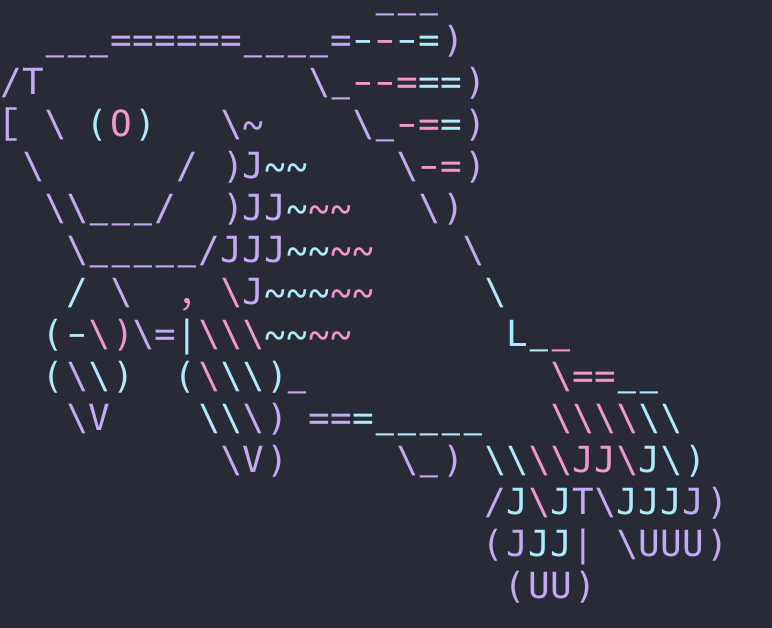

# Tools-and-tricks-for-Cancer-Genome-Analysis

Installation and usage for various tools for cancer genomics

## Contributors

Qingxiang (Allen) Guo  
Postdoctoral Fellow  
Northwestern University, Feinberg School of Medicine
qingxiang.guo@northwestern.edu

## Introduction

In this section, I provide the installation and usage for a wide range of bioinformatics tools, especially for cancer genomics. This repo will be kept updating. Feedback or experience is warmly welcomed.

## Tools

## Data transfer

### [fasterq-dump](/contents/fasterq.md)

## Configuration and management

### [Conda and Mamba](/contents/conda.md)

### [Git](/contents/git.md)

### [Homebrew](/contents/homebrew.md)

## DNA and RNA-seq aligner (splice aware)

### [Minimap2](/contents/minimap2.md)

## Splice unware aligner

### [BWA-MEM](/contents/bwa.md)

### [BWA-MEM2](/contents/bwa2.md)

## RNA-seq aligner (splice aware)

### [STAR](/contents/STAR.md)

## Manipulating and analyzing alignments

### [Samtools](/contents/samtools.md)

### [Picard](/contents/picard.md)

### [mosdepth](/contents/mosdepth.md)

### [BCFtools](/contents/bcftools.md)

## Indel calling

### [transindel](/contents/transindel.md)

## Genome structural variation detection (NGS)

### [lumpy](/contents/lumpy.md)

### [Delly](/contents/delly.md)

### [Manta](/contents/manta.md)

## Genome structural variation detection (long read)

### [SVIM](/contents/SVIM.md)

### [PBSV](/contents/pbsv.md)

### [Sniffles2](contents/sniffles2.md)

### [cuteSV](/contents/cuteSV.md)

## Genome structural variation VCF manipulation

### [SURVIVOR](/contents/SURVIVOR.md) 

### [surpyvor](/contents/surpyvor.md) 

## Genome structural variation simulation

### [VISOR](/Tools-for-Cancer-Genome-Analysis/contents/VISOR.md) 

## Gene fusion analysis - RNA-seq level

### [Arriba](/contents/arriba.md)

## Other small tricks and tips

### Find and load R in Northwestern quest  

You can see which versions of R are available on Quest, and which version is the default, with the command  

```bash
module spider R
```

You can make a particular version of R available to use by typing the full module name with the version included as listed in the output  

```bash
module load R/4.2.0
```

### Batch download SRA files from NCBI

Go to the NCBI SRA site, select the SRA file you need and go to "Run selector" to got batch list in this way.

Use perl one-liner to process the header

```bash
perl -p -i -e 's/(\S+)\n/"$1", /g' list
```

Revise the script and batch download with the python script:

```bash
# _*_ coding=utf-8 _*_
import subprocess

# Insert your SRR accession numbers here
sra_accession_number = ["SRR11951439", "SRR11951443", "SRR11951444", "SRR11951445", "SRR11951446", "SRR11951447", "SRR11951448",
                        "SRR11951449", "SRR11951450", "SRR11951451", "SRR11951452", "SRR11951453", "SRR11951454", "SRR11951455",
                        "SRR11951456", "SRR11951457", "SRR11951458", "SRR11951459", "SRR11951460", "SRR11951461", "SRR11951462",
                        "SRR11951463", "SRR11951464", "SRR11951465", "SRR11951466", "SRR11951467", "SRR11951468", "SRR11951469",
                        "SRR11951470", "SRR11951471", "SRR11951472", "SRR11951473", "SRR11951474", "SRR11951475", "SRR11951476",
                        "SRR11951477", "SRR11951478", "SRR11951479", "SRR11951480", "SRR11951481", "SRR11951482", "SRR11951483",
                        "SRR11951484", "SRR11951485", "SRR11951486", "SRR11951487", "SRR11951488", "SRR11951489", "SRR11951490",
                        "SRR11951491", "SRR11951492", "SRR11951493", "SRR11951494", "SRR11951495", "SRR11951496", "SRR11951497",
                        "SRR11951498", "SRR11951499", "SRR11951500", "SRR11951501", "SRR11951502", "SRR11951503", "SRR11951504",
                        "SRR11951505", "SRR11951506", "SRR11951507", "SRR11951508", "SRR11951509", "SRR11951510", "SRR11951511",
                        "SRR11951512", "SRR11951513", "SRR11951514", "SRR11951515", "SRR11951516", "SRR11951517", "SRR11951519",
                        "SRR11951520", "SRR11951521", "SRR11951522", "SRR11951523", "SRR11951524", "SRR11951525", "SRR11951526",
                        "SRR11951527", "SRR11951528", "SRR11951530", "SRR11951531", "SRR11951532", "SRR11951533", "SRR11951534",
                        "SRR11951535", "SRR11951536", "SRR11951537", "SRR11951542"]

# This will download the .sra files to ~/ncbi/public/sra/ (will create directory if not present)
for sra_id in sra_accession_number:
    print("Current downloading" + sra_id)
    prefetch_cmd = "prefetch " + sra_id + " -O /home/qgn1237/qgn1237/2_raw_data/smooth_seq_95_sc_K562_SMRT" # Note the space between commands
    print("The running command is " + prefetch_cmd)
    subprocess.call(prefetch_cmd, shell=True)

# This will create the fastq file from the downloaded sra file
for sra_id in sra_accession_number:
    print("Creating fastq file for" + sra_id)
    fasterq_dump_cmd = "fasterq-dump /home/qgn1237/qgn1237/2_raw_data/smooth_seq_95_sc_K562_SMRT/" + sra_id + " -O /home/qgn1237/qgn1237/2_raw_data/smooth_seq_95_sc_K562_SMRT/" + sra_id # Use the fstring here
    print("The running command is " + fasterq_dump_cmd)
    subprocess.call(fasterq_dump_cmd, shell=True)
```

### Batch remove a certain type of files from a directory

```bash
python batch_delete_all_sra_files.py
```

### Use Mamba or Conda environment in Slurm Batch sbumit in NU Quest

You have to resource the mamba by yourself

```bash
#!/bin/bash
#SBATCH --account=b1042
#SBATCH --partition=genomics ## Required: (buyin, short, normal, long, gengpu, genhimem, etc)
#SBATCH --time=03:00:00 ## Required: How long will the job need to run (remember different partitions have restrictions on this parameter)
#SBATCH --nodes=1 ## how many computers/nodes do you need (no default)
#SBATCH --ntasks-per-node=6 ## how many cpus or processors do you need on per computer/node (default value 1)
#SBATCH --mem=35G ## how much RAM do you need per computer/node (this affects your FairShare score so be careful to not ask for more than you need))
#SBATCH --job-name=allen_download ## When you run squeue -u  this is how you can identify the job
#SBATCH --output=output.log ## standard out and standard error goes to this file

# A regular comment in Bash
/home/qgn1237/2_software/mambaforge/bin/mamba init

source ~/.bashrc

mamba activate mamba666

minimap2 -d /home/qgn1237/qgn1237/1_my_database/GRCh38_p13/minimap2_index/GRCh38.p13.genome.mmi /projects/b1171/qgn1237/1_my_database/GRCh38_p13/GRCh38.p13.genome.fa -t 6
```

### Batch create directories from list

```bash
python ./batch_create_directory_from_list.py
```

### Cancel a job in NU Quest

```bash
scancel -u NETID
```
### Kill a job

```bash
scancel 35087 
```

### Solve the error when connecting quest using SSH client: client_global_hostkeys_private_confirm: server gave bad signature for RSA key 0

This might because the cliend delete your key file, and the server can't recognize you.
Run the cmd to regenerate the keys:

```bash
/usr/bin/ssh-keygen -A
```

### Estimate genome coverage from sorted BAM file to exclude files with too low genome coverage

```estimate_bam_genome_coverage.py```

It will produce a coverage_list, exclude single cells that less than 10% coverage, and get a bad list

```second_coloumn_smaller_than.py```

### Calculate the genome depth (total mapped length/total genome base)

```
calculate_genome_depth_fast.py <your BAM file>
```


### How to remain connect with SSH on MAC

```bash
sudo vim /etc/ssh/sshd_config
```

Then edit the content: #ClientAliveInterval 900 #ClientAliveCountMax 10

```bash
sudo launchctl start com.openssh.sshd
```

### Make a alias for your command

```bash
alias sq='squeue | grep "netid"'

alias cdd='cd ../../'

alias ma='mamba activate mamba666'

alias rl='readlink -f'

alias sb='sbatch'

alias lsn='less -SN'

alias vim='nvim'

alias ls='lsd'
```

Add these lines to ~/.bash.rc then source

### Upload seq data directly from Nanopore to NU Quest server

You can treat Nanopore MinION as a server itself. First, login into MinION with wifi, and get the IP address of MinION. Then, at your on PC terminal, type： ssh -x minit@<IP>. The it will ask you for the password. The password is: minit. Then you will login into MinION system.

Navigate the system, cd .. to the higher level of directory and find your data.

Then use the following command to transfer

```bash
rsync -avz /path/to/minion/files qgn1237@quest.northwestern.edu:/home/qgn1237

# Then it will ask you for the password of northwestern Quest
```

### Use bash to loop make new directory in current directory

```bash
for dir in */; do cd "$dir"; mkdir 10X_depth ; cd ..; done
```

### Generate sbatch cmd list by specifying the input file and the suffix you want, this can sava time and avoid mistake

```bash
# Edit the cmd = f"samtools view -s 0.384 -b {input_file_abs_path} -@ 8 > {input_file_base_name}.{suffix}" in generate_cmd.py to your desired command
./generate_cmd.py ../VCaP.bam 10X.bam 

# Then excute in the directory where you want to store the ouput file
sbatch cmd_list

# You can customize the command as you like

./pbsv2_cmd.py 22Rv1_10X_sort.svsig.gz var.vcf
```

### Add the PATH environment variable 

```bash
echo 'PATH=$PATH:/home/qgn1237/1_script' >> ~/.bashrc
source ~/.bashrc
```

### Find the files end with certain suffix in current direcotry

```bash
find_suffix_in_current_directory.py <suffix>
```

### Filter vcf based on quality

```bash
filter_vcf_based_on_quality.py input.vcf 20 > output.vcf
```

### Install and import Dracula theme (my favorite theme) into Iterm2, Chrome Vimium, Chrome

For Iterm2 go to any folder and run command: 

```bash
git clone https://github.com/dracula/iterm.git

cd iterm/  # The go to the profiles, colors, and import the  Dracula.itermcolors, 

# Then select Dracula in color presets done!
```

For Vimium,go into the Vimium addon's preferences, right-click the Vimium icon next to the address bar and select “Manage Extension.” On the Extensions page, paste <https://raw.githubusercontent.com/dracula/vimium/master/vimium-dracula.css> to CSS for Vimium UI

For Chrome, install in <https://chrome.google.com/webstore/detail/dracula-chrome-theme/gfapcejdoghpoidkfodoiiffaaibpaem>

### Copy all the file including hidden files

cp -r ~/OneDrive\ -\ Northwestern\ University/deep_learning_math_theory/. ./

### Use Python script to fulfill the function of Bash "for $dir in ./; do ..."

```bash
bash_cmd_to_python.py
```

### How to configure the local SSH and key to enable rapid login

first edit the file: ~/.ssh/config
Add content:

```bash
Host quest
    HostName quest.northwestern.edu
    User XXX
    Port 22
```

create a SSH key and copy to server

```bash
ssh-keygen
# you will be prompted to enter a passphrase for the key, enter for no password. This is a password for password. Don't use it.

ssh-copy-id quest
# copy your public key to an existing server, it will prompt you for the password of the remote user’s account
# Type in the password (your typing will not be displayed for security purposes) and press ENTER. 
# The utility will connect to the account on the remote host using the password you provided. It will then copy the contents of your 
# ~/.ssh/id_rsa.pub key into a file in the remote account’s home ~/.ssh directory called authorized_keys.

# You should be able to log into the remote host without the remote account’s password
ssh quest
```

### Download from quest to local and upload from local to quest

```bash
rsync -azvhP quest:~/R/ ./local

rsync -azvhP ./Tools-for-Cancer-Genome-Analysis/scripts/plot_VCF_chrom_freq_count.py quest:~/1_script/
```

### Install NeoVim from source code

You need to install new gcc, cmake, and make

```bash
git clone https://github.com/neovim/neovim

make CMAKE_INSTALL_PREFIX=/home/qgn1237/2_software/mambaforge/envs/mamba666/

make install

# add alias
alias vim='nvim'
```

### Find a file by name 

```bash
find ./ -name "my_software_overlapp*"
```

### Double loop in bash, this can make you more efficient

```bash
for i in 22Rv1 DU145 LNCaP PC3 VCaP; do cd $i; for j in ./*depth; do rl $j/delly/*_filtered.vcf > $j/SURVIVOR/list_vcf; rl $j/manta/results/variants/tumorSV.vcf >> $j/SURVIVOR/list_vcf; done; cd ..; done
```

### Usage of Rust Cargo to install rm-improved, which will give you a trash can for deletion

```bash
cargo install rm-improved
# Then you will have 'rip' command
mkdir trash_can
# Remove file
rip t.p 
# Undo the last deletion
rip -u
# Change the graveyard 
export GRAVEYARD=/home/qgn1237/qgn1237/trash_can
# You can also udo specific files
rip -u 
```

### Error: AttributeError: module 'matplotlib' has no attribute 'use'"

```bash
# Uninstall and install matplotlib again
pip uninstall matplotlib
pip install matplotlib
```

### Useful Rust command collection, lsd command, dust command in Rust

The next gen ls command, a more intuitive version of du in rust

```bash
cargo install lsd
cargo install du-dust
# You can then alias the lsd to ls
```

### Allow automatic in VScode

### Soft link your file to Onedrive in Windows

```dos
mklink /D "OneDrive path/file_name" "/local/file_name"
```

Then the file will be automatically updated.

### Install Starship prompt in your linux system or mac local system

Starship is the minimal, blazing-fast, and infinitely customizable prompt for any shell! Let's install in quest first.

```bash
curl -O https://starship.rs/install.sh
chmod 755 install.sh
# Install to your own directory
./install.sh -b ~/.local/bin

# If you use bash shell, add the following to the end of ~/.bashrc:
# Before conda init block!
eval "$(starship init bash)"
source ~/.bashrc

# If you use mac Fish, add the following in the center  ~/.config/fish/config.fish:
starship init fish | source 

# Exit and you're done!
```

### Make use of ~/.local/bin

Try to make a bin file if there is not. The /home/qgn1237/.local/bin will by default in your $PATH. So try to link or move the binary file of your different mamba/conda ENV in this directory, so you don't need to shift between ENV now.

For example

```bash
[qgn1237@quser23 ~]$ which vim
alias vim='nvim'
	~/.local/bin/nvim
```

### Install Fish on MAC and switch from Bash to Fish as default shell

First make sure you have installed Homebrew.

```bash
brew install fish
# Make sure that you've successfully installed Fish
fish --version
# Make Fish as your default shell
# Add /usr/local/bin/fish to your list of shells

# It should be noted that, for the M2 chip mac, homebrew will not install stuff
# in /usr/local/bin/fish , but /opt/homebrew/bin/fish

# Besides, the following command will not work 
sudo echo /usr/local/bin/fish >> /etc/shells
Changing shell for qgn1237.
Password for qgn1237:
chsh: /usr/local/bin/fish: non-standard shell

# This is because, the latter doesn't work because the 
# output redirection >> is (tried to be) applied by the shell 
# before the sudo … is executed, and of course the user shell 
# has no permission to do that.
```

Instead, you should do:

```bash
echo /opt/homebrew/bin/fish | sudo tee -a /etc/shells
chsh -s /opt/homebrew/bin/fish
```

Exit and restart your shell, you'are done.

```bash
# Fish can do many little tricks
# Calculation
math 2/5
0.4
```

### Install Fish shell on a remote cluster that you can not sudo

I've rarely explore the other possibility besides bash, and I don't think comfort zone is a good sign for me. So I decide to switch to Fish, which seems to be more powerful.

```bash
# You can refer to https://yangyangli.top/posts/012-make-a-powerful-ternimal/
# Know your current shell
echo $SHELL
# Go to mamba environment
ma
# Build from source code
wget https://github.com/fish-shell/fish-shell/archive/refs/tags/3.6.0.tar.gz
tar zxf 3.6.0.tar.gz
cd fish-shell-3.6.0/
mkdir build
cd build
cmake -DCMAKE_INSTALL_PREFIX=$HOME/.local ..
# This would install fish and its associated files under $HOME/.local. The fish executable would be located in $HOME/.ocal/bin (which you may want to add to your $PATH).
make
make install
```

When you type: fish, it shows:
fish: error while loading shared libraries: libpcre2-32.so.0: cannot open shared object file: No such file or director

This because fish can not find the lib file, and you also don't have the permission
to /usr/local/lib. The solution is to find the path of libpcre2-32.so.0 

```bash
❯ find_suffix_in_current_directory.py libpcre2-32.so.0
./2_software/mambaforge/pkgs/pcre2-10.40-hc3806b6_0/lib/libpcre2-32.so.0
./2_software/mambaforge/envs/mamba_py_39/lib/libpcre2-32.so.0
./2_software/mambaforge/envs/mamba666/lib/libpcre2-32.so.0

echo 'export LD_LIBRARY_PATH=$LD_LIBRARY_PATH:~/2_software/mambaforge/pkgs/pcre2-10.40-hc3806b6_0/lib/' >> ~/.bashrc
source ~/.bashrc

# Type fish and you're good!
# Now make it as your default shell
vim ~/.config/fish/config.fish
# add 
starship init fish | source
# When you go to fish, the starship will prompt automatically.
```

Next step, let's make you to change to Fish automatically while connect to server.
chsh won't do it without the shell being listed in /etc/shells, and other ways of editing that configuration also require root permissions. 

```bash
# Add this to .bashrc
if [[ $- = *i* ]]; then
   exec fish
fi
```

Now you're all good, everytime you login into bash, bashrc will lead you to fish
Then fish will start starship automatically.

### The fish version can not be shown, the git version may be too old

```bash
# Upgrade your git command first
mamba install -c anaconda git
# Uninstall fish
rip /home/qgn1237/.local/etc/fish/
rip /home/qgn1237/.local/share/fish
rip /home/qgn1237/.config/fish
cd /home/qgn1237/.local/bin
rip fish fish_indent fish_key_reader

# Reinstall fish
git clone https://github.com/fish-shell/fish-shell.git
cd fish-shell/
cmake -DCMAKE_INSTALL_PREFIX=$HOME/.local .
make
make install

fish --version
# fish, version 3.6.0-24-g16369a3ab

# You're good now. The problem is because that the git is too old.
# Fish generates the version at build time with the build_tools/git_version_gen.sh script
```

### Permantly add alias (functions) to fish

```fish
alias -s sq='squeue | grep "qgn1237"'

alias -s cdd='cd ../../'

alias -s ma='mamba activate mamba666'

alias -s rl='readlink -f'

alias -s sb='sbatch'

alias -s lsn='less -SN'

alias -s vim='nvim'

alias -s ls='lsd'

# That creates ~/.config/fish/functions/ls.fish which will then be available in any fish session.
```

Or you can edit the fish rc file

```bash
vim ~/.config/fish/config.fish
# Add all the alis to thr fishrc file
```

### Add mamba to Fish shell

Fish will automatically load your .bashrc file.
But you have to add mamba to fish manually.

```fish
# add the following to ~/.config/fish/config.fish
# Adapted from `function conda` printed by `conda shell.fish hook`, following
# `mamba.sh`.
function mamba --inherit-variable CONDA_EXE
  if [ (count $argv) -lt 1 ]
    $CONDA_EXE
  else
    set -l mamba_exe (dirname $CONDA_EXE)/mamba
    set -l cmd $argv[1]
    set -e argv[1]
    switch $cmd
      case activate deactivate
        eval ($CONDA_EXE shell.fish $cmd $argv)
      case install update upgrade remove uninstall
        $mamba_exe $cmd $argv
        and eval ($CONDA_EXE shell.fish reactivate)
      case '*'
        $mamba_exe $cmd $argv
    end
  end
end 
```

```fish
mamba init fish
# This will add lines to your fish rc file
```

Now you can do:

```fish
mamba activate mamba666
# Backup your rc file
cp ~/.config/fish/config.fish ~/.config/fish/config.fish.bk
```

The idea is to give mamba the power to do mamba activate like conda activate.


### Install Oh-my-fish shell on a remote cluster that you can not sudo

Oh My Fish provides core infrastructure to allow you to install packages which extend or modify the look of your shell. It's fast, extensible and easy to use.

```fish
curl https://raw.githubusercontent.com/oh-my-fish/oh-my-fish/master/bin/install > install
fish install --path=~/.local/share/omf --config=~/.config/omf
# Install aborted: Git version 1.9.5 or greater required; you have 1.8.3.1
mamba activate mamba666 # We have the new git here.

fish install --path=~/.local/share/omf --config=~/.config/omf
# It will succeed this time.
```

### Install fish LOGO function by oh-my-fish

```fish
omf install fish_logo

# Add this to your fish greeting with this function:
function fish_greeting
    fish_logo
end

# Just write it to ~/.config/fish/functions/fish_greeting.fish
# You will see it every time you start a new session.
```

<div align=center>

</div

### Install Oh-My-Fish theme

```fish
# All your available theme
omf theme
omf install bobthefish
```

### Uninstall Oh-My-Fish  

```fish
ma # Go to mamba666 env with higher git version
omf destroy
```

### Install Starship presets

```fish
starship preset pastel-powerline > ~/.config/starship.toml
```

### Set environmental variable in Fish 

```fish
set -U fish_user_paths /opt/homebrew/bin $fish_user_paths
```

### A more efficient way to produce commandline and submit jobs in quest (fish shell)

This is a useful script from Tingyou Wang.

```fish
# n means the number of command you want to divide
divide -i cmd_list_332 -n 4 
sub # Write by myself
```

### Use Fish shell to do loop

The fish shell language is more clean and comfortable.

```fish
for dir in (ls -d SRR11563614 SRR11563615 SRR11563616)
    set source_dir "$dir/$dir"
    set target_dir "$dir"
    mv "$source_dir"/*.sra "$target_dir"
    rip "$source_dir"
end
```

### Install Fisher and install functions 

A plugin manager for Fish—the friendly interactive shell.

```fish
curl -sL https://git.io/fisher | source && fisher install jorgebucaran/fisher

# Install functions
fisher install laughedelic/fish_logo
```

### Setting vscode as the default editor for text files in Mac Finder

```fish
brew install duti

# To set all text files and code files to vscode instead of xcode use this set of shell commands.

duti -s com.microsoft.VSCode public.json all
duti -s com.microsoft.VSCode public.plain-text all
duti -s com.microsoft.VSCode public.python-script all
duti -s com.microsoft.VSCode public.shell-script all
duti -s com.microsoft.VSCode public.source-code all
duti -s com.microsoft.VSCode public.text all
duti -s com.microsoft.VSCode public.unix-executable all
# this works for files without a filename extension
duti -s com.microsoft.VSCode public.data all

duti -s com.microsoft.VSCode .c all
duti -s com.microsoft.VSCode .cpp all
duti -s com.microsoft.VSCode .cs all
duti -s com.microsoft.VSCode .css all
duti -s com.microsoft.VSCode .go all
duti -s com.microsoft.VSCode .java all
duti -s com.microsoft.VSCode .js all
duti -s com.microsoft.VSCode .sass all
duti -s com.microsoft.VSCode .scss all
duti -s com.microsoft.VSCode .less all
duti -s com.microsoft.VSCode .vue all
duti -s com.microsoft.VSCode .cfg all
duti -s com.microsoft.VSCode .json all
duti -s com.microsoft.VSCode .jsx all
duti -s com.microsoft.VSCode .log all
duti -s com.microsoft.VSCode .lua all
duti -s com.microsoft.VSCode .md all
duti -s com.microsoft.VSCode .php all
duti -s com.microsoft.VSCode .pl all
duti -s com.microsoft.VSCode .py all
duti -s com.microsoft.VSCode .rb all
duti -s com.microsoft.VSCode .ts all
duti -s com.microsoft.VSCode .tsx all
duti -s com.microsoft.VSCode .txt all
duti -s com.microsoft.VSCode .conf all
duti -s com.microsoft.VSCode .yaml all
duti -s com.microsoft.VSCode .yml all
duti -s com.microsoft.VSCode .toml all
```

### Save the ~/.config file to save your shell configuration

```bash
# You can save this whole directory, make your transfer and installation easier
/home/qgn1237/.config
```

### Useful fish command collection - autopair.fish 

```fish
# autopair.fish, auto-complete matching pairs in the Fish command line. Type pair () for you.
fisher install jorgebucaran/autopair.fish
```

### Useful fish command collection - z.fish

```fish
z tracks the directories you visit. With a combination of frequency and recency,
it enables you to jump to the directory in mind.

# Install
fisher install jethrokuan/z
z foo: Goes to directory best matching foo.
zo foo: Opens file manager of directory best matching foo.
z -t foo: Goes to most recent directory matching foo.
z -x: Removes the current directory from $Z_DATA.
```

### Calculate the allele frequency from the AD and SAC info field in a structural variants vcf file

chr1    10837   svim.INS.4      N       <INS>   8       PASS    SVTYPE=INS;END=10837;SVLEN=79;SUPPORT=7;STD_SPAN=5.8;STD_POS=40.06      GT:DP:AD        0/1:30:23,7

 It is possible to calculate the allele frequency from the AD info in this specific structural variants VCF file. The AD field lists the depth of coverage for each allele at a particular variant site, in this case, the AD field has two values separated by a comma (23, 7). To calculate the frequency, you can divide the number of reads supporting the alternate allele (7) by the total number of reads (23 + 7 = 30). So the allele frequency would be 7/30 = 0.23 or 23%.

DP4 is another form of SVC

DP4=0,0,14,12;

DP4 reports the number of reads covering the position with the reference allele mapped to forward and reverse strands, followed by alternate allele mapped to forward and reverse strands.

Allele frequency here would be 0 (0/26) for reference allele, and 1.0 (26/26) for alternate allele.

### xcrun: error: invalid active developer path (/Library/Developer/CommandLineTools), missing xcrun at: /Library/Developer/CommandLineTools/usr/bin/xcrun, you can't use your git after upgrading macOS

```bash
xcode-select --install
```

This will pop a dialogue box, Select "Install", and it will download and install the Command Line Tools package and fix the problem. 

### Update Yang lab Library

Edit the library.yaml file first, add the book name and STAR

Then

```
make cover
git add ..
git commit -n "n"
git push origin main
```

### Configure your NeoVim

Neovim (and many other applications) doesn't touch your ~/.config/ directory per default. You just need to create the nvim directory 

It's different from Vim, you need to:

```bash
mkdir -p ~/.config/nvim

nvim ~/.config/nvim/init.vim # Edit it

# For example, add: set mouse=v
```

### Can't Copy to Clipboard from neovim, what's wrong?

Becasue nvim sets your vim into visual mode whenever you select something with the mouse. And for some mad reason one is not allowed to copy when in visual mode. You can get around it by holding down shift when selecting text not to go into visual mode allowing you to use the copy menu.

Simply edit the ~/.config/nvim/init.vim and add:

set mouse=v

Done!

### Github push error: fatal: Unable to create '/Users/qgn1237/Library/CloudStorage/OneDrive-NorthwesternUniversity/github_project/Computational-Medicine-and-Bioinformatics-Terminology-Database/.git/index.lock': File exists.

The error message suggests that there is a lock file present, which typically means that another Git process is running or a previous Git process did not exit cleanly. To resolve the issue, follow these steps:

Make sure there are no other active Git processes running. Close any relevant terminal windows or Git applications that might be accessing the repository.

Remove the lock file manually. In your terminal, navigate to the repository's root directory and run the following command:

```bash
rm -f .git/index.lock
```

### Extract all the text from a powerpoint file.

```bash
pip install python-pptx

./extract_text_ppt.py 【20230413】qingxiang_guo_basic_seminar.pptx

# You can find it in the script directory
```

### Filter the structural variants VCF results

1. Filter the SVIM results

```bash
# A SVIM result looks like this:
GL000008.2  1524  svim.DEL.7  AGAATGGGATGGAATGGAATTGAATGATGTGGAGTGGAGTCGGGTGGAGTGGA A 2 PASS  SVTYPE=DEL;END=1576;SVLEN=-52;SUPPORT=2;STD_SPAN=4.24;STD_POS=14.85 GT:DP:AD  ./.:.:.,.

# Filtering the variant calls by QUAL, supporting reads, and PASS, we cannot make a general statement about suitable score cutoffs. # For high-coverage datasets (>40x), we would recommend a threshold of 10-15. For low-coverage datasets, the threshold should be lower.

# A good approach could also be to select a cutoff that returns the expected or desired number of calls. A recent study by the Human Genome Structural Variation Consortium (HGSVC), for instance, estimated the average number of deletions and insertions per individual to be 9,488 and 15,337, respectively (Chaisson et al., 2019)

bcftools filter -i 'QUAL >= 5 && FILTER == "PASS" && INFO/SUPPORT >= 2' input.vcf > output.vcf

This is a strict criteria that can filter 400,000 SVs to 2,000

So you should make trial & error
```

2. Filter the PBSV results

```bash
chr1    669597  pbsv.INS.DUP.0  A       <DUP>   .       PASS    SVTYPE=DUP;END=669679;SVLEN=82  GT:AD:DP:SAC    1/1:1,4:5:1,0,3,1
# PBSV will not have the SUPPORT reads option

bcftools filter -i 'FILTER == "PASS" && FORMAT/AD[0:1] >= 2' input.vcf > output.vcf
# When filtering SVs, the variants with high support can be filtered based on the threshold value of AD [1].
# The [0:1] means the 1 subfield of the 0 sample
```

3. Filter the Sniffles2 results
  
```bash
# Sniffles has already an automatic filter in the output.
# If you want to filter further, the easiest is to ignore the IMPRECISE marked calls 
# Another thing would be to filter for the number of read supports

chr1    710590  Sniffles2.INS.14S0      N       AAGAACTGCCTGCCGGGCGCGTGTGGCTCACGCCTTGTAATTCCCAGCACTTTGGGAGGCCGCAGGCGGGCCGGATCACGAGCGTCAGGAGATCGAGACCATCCCGGCTAAAACGGCTTTGAAAAAACCCCGTCTCTACTAAAAATTACAAAAAATTAGCCCCGTAGTGGCGGGCGCGTTTAGTCCCAGCTACTTTGCGGAGGCTGAGGCAGGAAGAATGGGCGTGAACCCGCGGAGGTGGAGCTTTGCAGTGAGCCTAAGATCCCACTCACTCCAGCCTGCGGCGACAGAGCCAGACTCGTCTCAAAAAAAAAAAAAAAAAAAAAAAAAAAA   31      PASS    PRECISE;SVTYPE=INS;SVLEN=333;END=710590;SUPPORT=3;COVERAGE=2,3,3,3,3;STRAND=+-;AF=1.000;STDEV_LEN=18.502;STDEV_POS=6.083;SUPPORT_LONG=0 GT:GQ:DR:DV     1/1:8:0:3

# DV：Depth of variant-supporting bases

bcftools view -i 'INFO/SUPPORT >= 2 && INFO/IMPRECISE != 1' intput.vcf > output.vcf
```

4. Filter the CuteSV results

```bash
chrY	56833655	cuteSV.DEL.48873	TCCTATTCCATTCCTC	T	.	PASS	PRECISE;SVTYPE=DEL;SVLEN=-15;END=56833670;CIPOS=-1,1;CILEN=-0,0;RE=3;RNAMES=NULL;STRAND=+-	GT:DR:DV:PL:GQ	./.:.:3:.,.,.:.

bcftools view -i 'FILTER == "PASS" && INFO/PRECISE == 1 && INFO/RE >= 2' input.vcf > output.vcf
```

5. Filter the DeBreak results

```bash
chrY	2464326	DB4000	TTCCCTAGCAATCCGGCCAAGGGCCGCTGATGTGCACACACTGAAGACGTTCCCTAAGTGTGTGGCTAAGGGACTGCTACCATATACACACTGAAGATGTTCCCTAAGAATGTGGGTAAGGGACCGCCGCCATGTTCGCACTGAAGACG	N	.	PASS	CHR2=chrY;SVLEN=149;SUPPREAD=4;MAPQ=0;SVMETHOD=DeBreak;PRECISE;SVTYPE=DEL	GT	0/1

bcftools view -i 'FILTER == "PASS" && INFO/PRECISE == 1 && INFO/SUPPREAD >= 2' input.vcf > output.vcf
```

6. Filter the SVDSS results

```bash
chrX	147512934	DEL_chrX:147512934-147512961_28	TTGCAGTACAATACACATTGTATTACAC	T	.	PASS	VARTYPE=SV;SVTYPE=DEL;SVLEN=-28;END=147512961;WEIGHT=2;COV=4;AS=358;NV=1;CIGAR=33=28D46=	GT	0/1

# You can filter the reported SVs by passing the --min-sv-length and --min-cluster-weight options. These options control the minimum length and minimum number of supporting superstrings for the reported SVs. Higher values for --min-cluster-weight will increase precision at the cost of reducing recall. For a diploid 30x coverage sample, --min-cluster-weight 2 produced the best results in our experiments. For a haploid 30x sample, instead, --min-cluster-weight 4 produced the best results.

bcftools view -i 'FILTER == "PASS" && INFO/NV >= 2' input.vcf > output.vcf
```

### Convert BED to VCF coordinate

If BED start and end = 0  8, VCF start =1, end = 8
BED is 0-based coordinate system, VCF is 1-based

### Search certain line in a file using